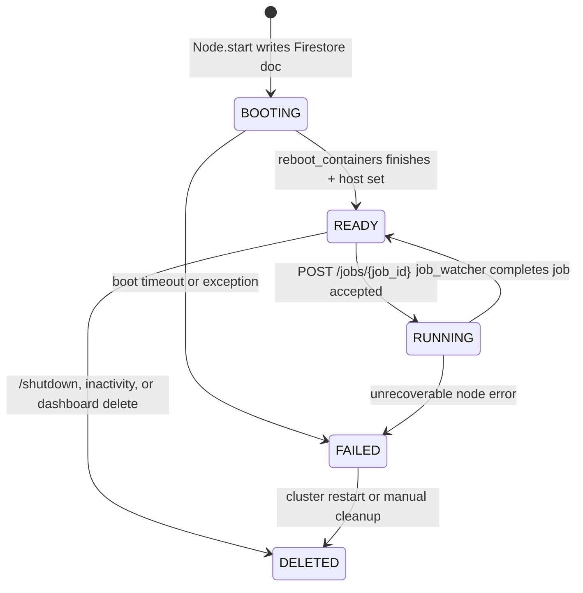

# Cluster Operations

Everything about how the cluster itself is managed — booting VMs, growing mid-job, node state, shutdown — lives here.

## Node state machine



The status string lives in two places that must agree:
- Firestore: `nodes/{instance_name}.status`
- Node-local: `SELF["BOOTING"]`, `SELF["RUNNING"]`, `SELF["FAILED"]` (all three False ⇒ READY). `SELF["SHUTTING_DOWN"]` is a separate flag set by the inactivity watchdog.

Firestore is authoritative for the rest of the cluster; `SELF` is authoritative for what the node will accept next.

`main_service` keeps an in-memory `NODES_CACHE` (`{instance_name: doc_dict}`) populated by a Firestore `on_snapshot` listener filtered to `status in [BOOTING, RUNNING, READY, FAILED]`. All of the client-facing endpoints that read node state (`GET /v1/cluster/state`, `GET /v1/cluster/nodes/{id}`, the node-selection step inside `POST /v1/jobs/{id}/start`) hit this dict instead of Firestore. `lifespan` blocks startup until the listener's first fire completes (or until a 10s timeout), so no request is ever served with a cold cache.

## Main-service cluster endpoints

All defined in [main_service/src/main_service/endpoints/cluster_lifecycle.py](../../../main_service/src/main_service/endpoints/cluster_lifecycle.py) except `start_job` (the growth path), which lives in [main_service/src/main_service/endpoints/client.py](../../../main_service/src/main_service/endpoints/client.py).

### `POST /v1/cluster/restart`

Marks all currently `RUNNING` jobs with `status: CANCELED` + `cluster_restarted: True` synchronously (so clients see the signal before their nodes disappear), then schedules `_restart_cluster` as a background task. `_restart_cluster` runs `_shutdown_cluster` followed by `_start_nodes(config)`. Config comes from `_get_cluster_config` (served from `CLUSTER_CONFIG_CACHE` if warm, one Firestore read otherwise; in local-dev mode it returns `LOCAL_DEV_CONFIG` unconditionally).

### `POST /v1/cluster/shutdown`

Same pre-write (`cluster_shutdown: True` on running jobs), then `_shutdown_cluster` synchronously: queries `nodes` where status in `[READY, BOOTING, RUNNING]`, constructs a `Node.from_snapshot` for each, calls `node.delete()` in a thread pool. In local-dev, also `docker rm -f` any leftover `node_*` / `*worker*` containers.

### Mid-job grow — `POST /v1/jobs/{job_id}/start`

There is **no** `/v1/cluster/grow` endpoint anymore. Growth happens inline when the client calls `/v1/jobs/{job_id}/start` with `grow=true`. `_grow_if_needed` in `endpoints/client.py`:

1. Computes `requested_parallelism = min(n_inputs, max_parallelism)` and the deficit vs. `target_parallelism` already covered by selected ready nodes.
2. For GPU jobs (`func_gpu` set), each additional node provides exactly one parallelism slot on the mapped single-GPU machine type.
3. For CPU jobs, translates deficit into cpus (accounting for RAM-per-CPU) and caps at `MAX_GROW_CPUS` (2560 in prod, `LOCAL_DEV_MAX_GROW_CPUS = 4` in local-dev).
4. For n4-standard clusters in prod, `_pack_n4_standard_machines` greedily fills with `n4-standard-80`s and a final smaller size for the remainder (sizes: 80, 64, 32, 16, 8, 4, 2 — `n4-standard-48` is intentionally excluded). For GPU clusters and local-dev it uses the configured machine type homogeneously.
5. Pre-generates instance names (`burla-node-{uuid8}`) and schedules `_start_nodes(..., reserved_for_job=job_id)` in the background. Returns a list of `{instance_name, target_parallelism}` dicts as `booting_nodes` in the response so the client can start waiting for those specific nodes immediately.

Nodes booted this way always get `inactivity_shutdown_time_sec = GROW_INACTIVITY_SHUTDOWN_TIME_SEC` (60s) regardless of the cluster-config value, so a burst-scaled job doesn't leave expensive hardware idle after it finishes.

### `reserved_for_job`

Nodes booted by the grow path start with `RESERVED_FOR_JOB={job_id}` in their env vars, which lands in Firestore as `reserved_for_job` on the node doc. `_select_ready_nodes_from_cache` filters these out so no **other** job picks them up. The reservation is cleared in two places:

- `on_job_start` in `node_service/__init__.py` clears it the moment the reserved job's `POST /jobs/{id}` hits.
- `_watch_reservation` in `node_service/lifecycle_endpoints.py` watches the reserved job's doc; if the job finishes/fails before assignment, or 60s pass without assignment (`RESERVATION_ASSIGNMENT_TIMEOUT_SEC`), the reservation is cleared so the node becomes available.

## `Node.start` — booting a single VM

In [main_service/src/main_service/node.py](../../../main_service/src/main_service/node.py). Steps:

1. Generate instance name (or use the one supplied by grow), write Firestore `nodes/{instance_name}` doc with `status: "BOOTING"`, the machine/disk/container spec, `started_booting_at`, and `reserved_for_job` if any.
2. Pick disk image by machine-type prefix:
   - `n4-*` → `projects/burla-prod/global/images/burla-node-nogpu-2`
   - `a2-*`, `a3-*` → `projects/burla-prod/global/images/burla-node-gpu-2` (GPU count parsed from the final segment)
   - Anything else raises.
3. In prod: `__start_svc_in_vm` — iterate `zones_supporting_machine_type(region, machine_type)`, catch `ServiceUnavailable` as zone-exhausted and try the next. A `Conflict` (node deleted while starting) raises immediately. Scheduling config depends on spot + GPU:
   - Spot: `SPOT` provisioning, `DELETE` on termination, `automatic_restart=False`.
   - Standard + no GPU: `MIGRATE` on maintenance (live migration), `automatic_restart=False`.
   - Standard + GPU: `TERMINATE` on maintenance, `automatic_restart=False`.
4. In local-dev: `__start_svc_in_local_container` — pulls `burla-node-service` image, mounts `node_service/` as a volume so code reloads on save, runs uvicorn with `--reload`. Hostname is `http://node_{suffix}:{port}` on the `local-burla-cluster` Docker network.
5. Wait for the node's HTTP `/` to return status `READY` or `RUNNING`, polling every 1s. Timeout: `NODE_BOOT_TIMEOUT = 600s`. On failure or timeout: update Firestore `status: "FAILED"`, log the traceback to `nodes/{id}/logs`, call `self.delete()`, re-raise.
6. On success: write `host` and `zone` to the Firestore doc. The node has already set its own status to READY via `reboot_containers` — `main_service` does NOT write status.

GCE API calls use `GCE_TRANSIENT_RETRY` (a `Retry(predicate=if_transient_error)`) to swallow ConnectionReset-class errors without masking `ZONE_RESOURCE_POOL_EXHAUSTED` (which comes through `ServiceUnavailable` and is handled explicitly).

## `reboot_containers` — the node's boot/reboot procedure

In [node_service/src/node_service/lifecycle_endpoints.py](../../../node_service/src/node_service/lifecycle_endpoints.py). Runs at node startup (from `lifespan`) and on `POST /reboot`.

1. Stop current job watcher, mark node `BOOTING` in Firestore (alongside clearing `current_job`, `parallelism`, `target_parallelism`, `all_inputs_received`, and bumping `started_booting_at`). `REINIT_SELF` resets in-memory state, preserving `current_container_config` and `reserved_for_job`.
2. Fetch the list of authorized users from `backend.burla.dev/v1/clusters/{project_id}/users` using `CLUSTER_ID_TOKEN` (Secret Manager). Cache in `SELF["authorized_users"]`.
3. Wipe existing worker containers: `kill` them, then schedule `remove` as a background task so reboot isn't blocked by slow GPU-container teardown. In local-dev, containers belonging to the current node are first renamed to `OLD--*` and stopped; any already-`OLD--` containers from the previous reboot cycle are killed + scheduled for removal.
4. Pull new images (`_pull_image_if_missing` — uses the `docker pull` CLI in prod with up to 5 retries on "unexpected EOF", `aiodocker` in local-dev because of docker-in-docker issues).
5. Create `WorkerClient` instances — one per CPU (or one per GPU if `NUM_GPUS > 0`).
6. Boot the **first** worker alone, let it download `uv` and set up `/worker_service_python_env`. The remaining workers share that volume-mounted env, so they boot in parallel.
7. Wait until `host` is written to the Firestore doc (main_service writes this after the VM/container comes up), then set `status: "READY"`.
8. If `SELF["reserved_for_job"]` is still set, launch `_watch_reservation` as a background task.

If anything fails: `SELF["FAILED"] = True`, Firestore status → `FAILED`, error logged to `nodes/{id}/logs` and to GCL, and (in prod) the VM deletes itself via `InstancesClient.delete`.

## Worker count per node

In `reboot_containers`:

```python
num_workers = INSTANCE_N_CPUS if NUM_GPUS == 0 else NUM_GPUS
```

`INSTANCE_N_CPUS = 2` in local-dev (hard-coded) or `os.cpu_count()` in prod. So an n4-standard-4 gets 4 workers, an a2-highgpu-1g gets 1 worker.

## Inactivity shutdown

In [node_service/src/node_service/__init__.py](../../../node_service/src/node_service/__init__.py) `shutdown_if_idle_for_too_long`:

- Background task launched from `lifespan` only when `INACTIVITY_SHUTDOWN_TIME_SEC` is set **and** `IN_LOCAL_DEV_MODE` is False (local-dev never runs this watchdog at all).
- Loop: sleep 5s, check `time() - SELF["last_client_activity_timestamp"]`.
- Exits the loop only when idle duration exceeds the threshold AND the node has no `current_job`, no `reserved_for_job`, no `active_client_request_count`, and isn't `BOOTING`.
- On exit: sets `SELF["SHUTTING_DOWN"] = True`, writes `status: "DELETED"`, `ended_at: time()` to the node doc (unless it's already FAILED), logs a warning, then finds the node's own VM via `InstancesClient.aggregated_list` and calls `.delete(...)`.

`last_client_activity_timestamp` is bumped by `TrackOpenRequestMiddleware` whenever an HTTP response body finishes (or the client disconnects), and by `handle_errors` on any 200 response.

## `Node.delete`

`Node.delete(self)` (no args):
- Reads the current doc. If status is `FAILED`, keeps it as `FAILED` so the doc remains visible for debugging.
- Otherwise sets status to `DELETED`.
- Calls `InstancesClient.delete` (wrapped in `GCE_TRANSIENT_RETRY`). `NotFound` and `ValueError` are swallowed as "already deleted".

The dashboard's `/v1/cluster/deleted_recent_paginated` reads both `DELETED` and `FAILED` nodes for up to 7 days after deletion (sort key: `deleted_at` or `started_booting_at`).

## Local-dev specifics

- `main_service/__init__.py` unconditionally seeds `cluster_config/cluster_config` with `DEFAULT_CONFIG` at import time if the doc is missing. `LOCAL_DEV_CONFIG` is initialized from that doc **and then** forced to `n4-standard-2 × 2` regardless of what's in Firestore (`settings.py` re-enforces single-node + `n4-standard-2` when saving cluster config in local-dev).
- Nodes are Docker containers, not VMs. Ports auto-increment starting from 8080 (`_current_local_dev_max_node_port`, computed by scanning existing active node docs' `host` fields).
- `gcsfuse` is stubbed out — `/workspace/shared` inside containers is just a bind-mount from `_shared_workspace/`, not a real GCS mount.
- `make local-dev` nukes `_worker_service_python_env/`, `_shared_workspace/`, and `_node_auth/` on startup for a clean slate.
- `make stop` runs `make/cluster_dashboard_dev_state.py delete_booting_nodes`, which removes stale BOOTING docs from Firestore — useful when a local-dev crash leaves them orphaned.
- The inactivity watchdog does not run in local-dev, so nothing auto-stops containers; rely on `make stop` or `POST /v1/cluster/shutdown`.

## Cluster config document shape (summary)

Lives in Firestore at `cluster_config/cluster_config`. Minimal shape (see `DEFAULT_CONFIG` in [main_service/__init__.py](../../../main_service/src/main_service/__init__.py)):

```json
{
  "Nodes": [
    {
      "containers": [{"image": "python:3.12"}],
      "machine_type": "n4-standard-4",
      "gcp_region": "us-central1",
      "quantity": 1,
      "inactivity_shutdown_time_sec": 600,
      "disk_size_gb": 20
    }
  ],
  "gcs_bucket_name": "{project_id}-burla-shared-workspace"
}
```

- `Nodes[0]` is the spec used as the template for GPU-machine-type and local-dev growth inside `POST /v1/jobs/{id}/start`. For n4-standard CPU growth, the configured machine type is ignored and `_pack_n4_standard_machines` picks sizes instead.
- `/v1/cluster/restart` (via `_start_nodes`) iterates all entries in `Nodes` and boots `quantity` of each.
- `gcs_bucket_name` is the bucket FUSE-mounted at `/workspace/shared` inside containers (stubbed in local-dev).
- `inactivity_shutdown_time_sec` is passed to each node as an env var at boot (grow overrides it to 60s).
