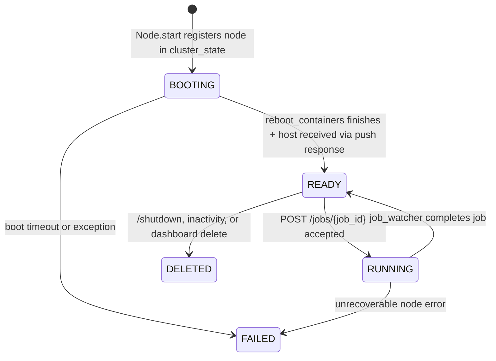

# Cluster Operations

Everything about how the cluster itself is managed (booting VMs, growing mid-job, node state, shutdown) lives here.

## Node state machine


```mermaid
stateDiagram-v2
    [*] --> BOOTING: Node.start registers node in cluster_state
    BOOTING --> READY: reboot_containers finishes + host received via push response
    BOOTING --> FAILED: boot timeout or exception
    READY --> RUNNING: POST /jobs/{job_id} accepted
    RUNNING --> READY: job_watcher completes job
    READY --> DELETED: /shutdown, inactivity, or dashboard delete
    RUNNING --> FAILED: unrecoverable node error
```

The status string lives in two places that must agree:
- Head: `cluster_state.NODES[instance_name]["status"]` on `main_service`, updated by the node's state pushes (merged by `cluster_state.update_node`).
- Node-local: `SELF["BOOTING"]`, `SELF["RUNNING"]`, `SELF["FAILED"]` (all three False ⇒ READY), mirrored into `SELF["reported_status"]`, the string the 1s push loop reports. `SELF["SHUTTING_DOWN"]` is a separate flag set by the inactivity watchdog.

The head's `cluster_state` is authoritative for the rest of the cluster; `SELF` is authoritative for what the node will accept next.

There is no cache layer and no listener: every endpoint that reads node state (`GET /v1/cluster/state`, `GET /v1/cluster/nodes/{id}`, the node-selection step inside `POST /v1/jobs/{id}/start`, the dashboard SSE streams) reads `cluster_state` directly (`list_nodes` / `get_node`), and the dicts stay fresh because every node PUTs its state to `/v1/nodes/{id}/state` roughly once per second. `update_node` enforces the merge rules: BOOTING/READY/RUNNING never overwrite a terminal DELETED/FAILED, DELETED never overwrites FAILED (failed nodes stay visible for debugging), and DELETED entries are persisted to history then dropped from memory. After a head restart, `cluster_state.load_from_history` reloads active nodes and RUNNING jobs, and the pushes correct any staleness within a second or two.

## Main-service cluster endpoints

All defined in [main_service/src/main_service/endpoints/cluster_lifecycle.py](../../../main_service/src/main_service/endpoints/cluster_lifecycle.py) except `start_job` (the growth path), which lives in [main_service/src/main_service/endpoints/client.py](../../../main_service/src/main_service/endpoints/client.py).

### `POST /v1/cluster/restart`

Marks all currently `RUNNING` jobs with `status: CANCELED` + `cluster_restarted: True` synchronously via `cluster_state.update_job` (so clients see the signal, riding their nodes' `/results` responses, before those nodes disappear), then schedules `_restart_cluster` as a background task. `_restart_cluster` runs `_shutdown_cluster` followed by `_start_nodes(config)`. Config comes from `_get_cluster_config` (`LOCAL_DEV_CONFIG` in local-dev, otherwise `history.get_cluster_config()` from the SQLite history db).

### `POST /v1/cluster/shutdown`

Same pre-write (`cluster_shutdown: True` on running jobs), then `_shutdown_cluster` synchronously: takes every node in `cluster_state.list_nodes()` with status in `[READY, BOOTING, RUNNING]`, constructs a `Node.from_state` for each, calls `node.delete()` in a thread pool. In local-dev, also `docker rm -f` any leftover `node_*` / `OLD--*` / `*worker*` containers.

### Mid-job grow: `POST /v1/jobs/{job_id}/start`

There is **no** `/v1/cluster/grow` endpoint anymore. Growth happens inline when the client calls `/v1/jobs/{job_id}/start` with `grow=true`. `_grow_if_needed` in `endpoints/client.py`:

1. Computes `requested_parallelism = min(n_inputs, max_parallelism)` and the deficit vs. `target_parallelism` already covered by selected ready nodes.
2. For GPU jobs (`func_gpu` set), new nodes use the machine type mapped in `GPU_MACHINE_TYPES` ([providers/catalog.py](../../../main_service/src/main_service/providers/catalog.py)) for the current cloud; each GPU serves exactly one function call.
3. For CPU jobs, translates deficit into cpus (accounting for RAM-per-CPU) and caps at `MAX_GROW_CPUS` (2560 in prod, `LOCAL_DEV_MAX_GROW_CPUS = 4` in local-dev).
4. For packable CPU families in prod (`n4-standard-*` on GCP, `m7i.*` on AWS), `pack_cpu_machines` greedily fills with the family's largest size and covers the remainder with the smallest size that fits (GCP sizes: 80, 64, 32, 16, 8, 4, 2; `n4-standard-48` is intentionally excluded). For GPU clusters and local-dev it uses the configured machine type homogeneously. Machine types that can't fit even one call at the requested `func_cpu`/`func_ram` are filtered out.
5. Pre-generates instance names (`burla-node-{uuid8}`) and schedules `_start_nodes(..., reserved_for_job=job_id)` in the background. Returns a list of `{instance_name, target_parallelism}` dicts as `booting_nodes` in the response so the client can start waiting for those specific nodes immediately.

Nodes booted this way always get `inactivity_shutdown_time_sec = GROW_INACTIVITY_SHUTDOWN_TIME_SEC` (60s) regardless of the cluster-config value, so a burst-scaled job doesn't leave expensive hardware idle after it finishes.

### `reserved_for_job`

Nodes booted by the grow path start with `RESERVED_FOR_JOB={job_id}` in their env vars, and `Node.start` records `reserved_for_job` on the node's `cluster_state` entry at registration. `_select_ready_nodes_from_state` filters these out so no **other** job picks them up. The reservation is cleared in two places:

- `on_job_start` in `node_service/__init__.py` clears it the moment the reserved job's `POST /jobs/{id}` hits: it cancels the `_watch_reservation` task and its RUNNING push carries `reserved_for_job: None`.
- `_watch_reservation` in `node_service/lifecycle_endpoints.py` polls the reserved job with `GET /v1/jobs/{id}` on the head every `RESERVATION_POLL_INTERVAL_SEC` (2s); if the job disappears or is no longer RUNNING, or 60s pass without assignment (`RESERVATION_ASSIGNMENT_TIMEOUT_SEC`), it clears `SELF["reserved_for_job"]` and pushes `reserved_for_job: None` so the node becomes available.

## `Node.start`: booting a single VM

In [main_service/src/main_service/node.py](../../../main_service/src/main_service/node.py). Steps:

1. Generate instance name (or use the one supplied by grow), register the node in `cluster_state` with `status: "BOOTING"`, the machine/disk/container spec, `started_booting_at`, `reserved_for_job` if any, and `host: None`. `num_gpus` comes from `machine_spec` in the catalog.
2. Create the instance through the compute provider ([providers/](../../../main_service/src/main_service/providers/), selected by `get_provider()` from `CLOUD_PROVIDER` / `IN_LOCAL_DEV_MODE`):
   - **GCP** (`gcp.py`): picks the disk image by machine-type prefix (`n4-*` → `burla-node-nogpu-2`, `a2-*`/`a3-*` → `burla-node-gpu-2`), iterates `zones_supporting_machine_type(region, machine_type)`, treats `ServiceUnavailable` as zone-exhausted and tries the next zone (all exhausted → `NoCapacity`), and raises `InstanceDeletedMidBoot` on `Conflict`. Scheduling: spot → `SPOT` provisioning + `DELETE` on termination; standard no-GPU → `MIGRATE` on maintenance; standard GPU → `TERMINATE`. API calls use `GCE_TRANSIENT_RETRY`.
   - **AWS** (`aws.py`): EC2 twin. The node AMI is looked up by the `burla-node-image=true` tag (built by `burla install --cloud aws`), AZs are iterated on capacity errors, GPU nodes are not supported yet.
   - **local-dev** (`local_docker.py`): a Docker container on the `local-burla-cluster` network with `node_service/` volume-mounted so code reloads on save; hostname is `http://node_{suffix}:{port}`.
   The startup script (assembled in `node.py`) talks to the head over HTTP with the cluster token: it reports progress via `POST /v1/nodes/{id}/logs:batch`, and its error trap curls `PUT /v1/nodes/{id}/state` with `status: FAILED` then `POST /v1/nodes/{id}/self_delete`. Nodes have no cloud API access, so even a failed VM asks the head to delete it.
3. Write `host` (and `zone`) into `cluster_state`. This is the host handshake: the node learns its host from state-push responses and won't report `READY` until it has one, so clients never see a READY node with `host: None`.
4. Wait for the node's HTTP `/` to return `READY` or `RUNNING`, polling every 1s. Timeout: `NODE_BOOT_TIMEOUT = 600s`. A `FAILED` status pushed by the startup-script trap (visible in `cluster_state`) also ends the wait. On failure or timeout: set the node `FAILED` in `cluster_state`, log the traceback via `add_node_log`, call `self.delete()`, re-raise.
5. `main_service` never writes `READY`: the node pushes its own READY at the end of `reboot_containers`.

## `reboot_containers`: the node's boot/reboot procedure

In [node_service/src/node_service/lifecycle_endpoints.py](../../../node_service/src/node_service/lifecycle_endpoints.py). Runs at node startup (from `lifespan`) and on `POST /reboot`.

1. Stop the current job watcher, then push `status: "BOOTING"` (with `current_job: None` and a fresh `started_booting_at`) to the head. The head refuses to downgrade a terminal status, so if the push response comes back `DELETED` or `FAILED` the node was deleted or failed externally and the boot aborts. `REINIT_SELF` resets in-memory state, preserving `current_container_config` and `reserved_for_job`.
2. Fetch the list of authorized users from `backend.burla.dev/v1/clusters/{project_id}/users` using `CLUSTER_ID_TOKEN` (a plain env var; services no longer read Secret Manager). Cache in `SELF["authorized_users"]`.
3. Wipe existing worker containers: `kill` them, then schedule `remove` as a background task so reboot isn't blocked by slow GPU-container teardown. In local-dev, containers belonging to the current node are first renamed to `OLD--*` and stopped; any already-`OLD--` containers from the previous reboot cycle are killed + scheduled for removal.
4. Pull new images (`_pull_image_if_missing`: uses the `docker pull` CLI in prod with up to 5 retries on "unexpected EOF", `aiodocker` in local-dev because of docker-in-docker issues).
5. Create `WorkerClient` instances: one per CPU (or one per GPU if `NUM_GPUS > 0`).
6. Boot the **first** worker alone, let it download `uv` and set up `/worker_service_python_env`. The remaining workers share that volume-mounted env, so they boot in parallel.
7. Wait for `host` to arrive in a state-push response (`main_service` writes it into `cluster_state` after the VM/container comes up and hands it down), pushing `BOOTING` once per second until it does, then push `status: "READY"`. A terminal status in any of those responses also aborts the boot.
8. If `SELF["reserved_for_job"]` is still set, launch `_watch_reservation` as a background task.

If anything fails: `SELF["FAILED"] = True`, push `FAILED` to the head, POST a short error message to `/v1/nodes/{id}/logs:batch` (the full traceback is only printed locally so users' container errors stay findable in the dashboard), and in prod call `request_self_delete()` so the head deletes the VM.

## Worker count per node

In `reboot_containers`:

```python
num_workers = INSTANCE_N_CPUS if NUM_GPUS == 0 else NUM_GPUS
```

`INSTANCE_N_CPUS = 2` in local-dev (hard-coded) or `os.cpu_count()` in prod. So an n4-standard-4 gets 4 workers, an a2-highgpu-1g gets 1 worker.

## Inactivity shutdown

In [node_service/src/node_service/__init__.py](../../../node_service/src/node_service/__init__.py) `shutdown_if_idle_for_too_long`:

- Background task launched from `lifespan` only when `INACTIVITY_SHUTDOWN_TIME_SEC` is set **and** `IN_LOCAL_DEV_MODE` is False (local-dev never runs this watchdog at all).
- Loop: sleep 5s, check `time() - SELF["last_client_activity_timestamp"]`.
- Exits the loop only when idle duration exceeds the threshold AND the node has no `current_job`, no `reserved_for_job`, no `active_client_request_count`, and isn't `BOOTING`.
- On exit: sets `SELF["SHUTTING_DOWN"] = True`, pushes `status: "DELETED"` + `ended_at` to the head (skipped if the node is already FAILED, so the FAILED status survives), logs a warning, then calls `head_client.request_self_delete()`: the head deletes the VM via the provider, because nodes have no cloud API access.

`last_client_activity_timestamp` is bumped by `TrackOpenRequestMiddleware` whenever an HTTP response body finishes (or the client disconnects), and by `handle_errors` on any 200 response.

## `Node.delete`

`Node.delete(self)` (no args):
- Calls `cluster_state.update_node` with `{"status": "DELETED", "ended_at": time()}`. The merge rules keep a FAILED entry FAILED (so it remains visible for debugging); a genuinely DELETED entry is persisted to history and dropped from live memory.
- Calls `provider.delete_instance(instance_name, zone)`. Already-deleted instances are swallowed silently.

The dashboard's `/v1/cluster/deleted_recent_paginated` reads `DELETED` and `FAILED` rows from the history db for up to 7 days (sort key: `ended_at`, falling back to `started_booting_at`), overlaying any still-live FAILED entries so status flips show immediately.

## Local-dev specifics

- `main_service/__init__.py` seeds the cluster config with `DEFAULT_CONFIG` at import time if none was ever saved: it lives in the SQLite history db (`cluster_config` table), not in any external service. `LOCAL_DEV_CONFIG` is initialized from that config **and then** forced to `n4-standard-2 × 2` regardless of what's stored (`settings.py` re-enforces `n4-standard-2` + single node when saving cluster config in local-dev).
- Nodes are Docker containers, not VMs (`LocalDockerProvider`). Ports auto-increment starting from 8080 (`_current_local_dev_max_node_port`, computed by scanning the `host` fields of active nodes in `cluster_state`).
- `gcsfuse` is stubbed out: `/workspace/shared` inside containers is just a bind-mount from `_shared_workspace/`, not a real bucket mount.
- `make local-dev` nukes `_worker_service_python_env/`, `_shared_workspace/`, and `_node_auth/` on startup for a clean slate.
- Coordination is fully offline: the history db lives inside the main_service container (at `/var/lib/burla/history.db`) and dies with it. `make stop` therefore just `docker rm -f`s the `node_*` / `worker_*` / `OLD--*` containers; there is no external state to clean up (`make/cluster_dashboard_dev_state.py` was deleted).
- The inactivity watchdog does not run in local-dev, so nothing auto-stops containers; rely on `make stop` or `POST /v1/cluster/shutdown`.

## Cluster config shape (summary)

Stored as a single row in the head's SQLite history db (`history.get_cluster_config` / `save_cluster_config`), seeded from `DEFAULT_CONFIG` in [main_service/__init__.py](../../../main_service/src/main_service/__init__.py):

```json
{
  "Nodes": [
    {
      "containers": [{"image": "python:3.12"}],
      "machine_type": "n4-standard-4",
      "gcp_region": "us-central1",
      "quantity": 1,
      "inactivity_shutdown_time_sec": 600,
      "disk_size_gb": 20
    }
  ],
  "gcs_bucket_name": "{project_id}-burla-shared-workspace"
}
```

- On AWS the defaults differ (`m7i` machine family, `us-east-1`), and `gcp_region` holds an AWS region: the field name is historical.
- `Nodes[0]` is the spec used as the template for GPU-machine-type and local-dev growth inside `POST /v1/jobs/{id}/start`. For packable CPU families the configured machine type is ignored and `pack_cpu_machines` picks sizes instead.
- `/v1/cluster/restart` (via `_start_nodes`) iterates all entries in `Nodes` and boots `quantity` of each.
- `gcs_bucket_name` names the shared-workspace bucket mounted at `/workspace/shared` inside containers: a GCS bucket on GCP (gcsfuse), an S3 bucket on AWS (mountpoint-s3), same naming convention, stubbed in local-dev.
- `inactivity_shutdown_time_sec` is passed to each node as an env var at boot (grow overrides it to 60s).
