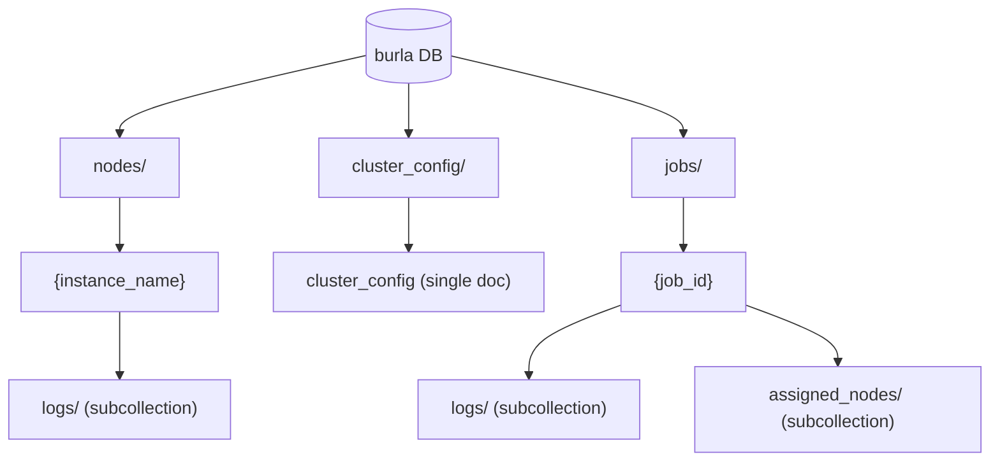

# Firestore Schema

Burla uses a single Firestore database named **`burla`** (not `(default)`). Every Firestore client in the repo passes `database="burla"` — forgetting this is the single most common source of "my query returns nothing" bugs.

Three top-level collections: `nodes`, `cluster_config`, `jobs`.

The `burla` pypi client never hits Firestore directly; it goes through `main_service` HTTP endpoints. `main_service` itself serves most node / job-start reads from in-memory caches (`NODES_CACHE`, `CLUSTER_CONFIG_CACHE`) kept in sync via Firestore `on_snapshot` listeners — direct Firestore reads in the request path are reserved for the dashboard and for dashboard-side filtering / streams.

## Collection overview



## `nodes/{instance_name}`

One document per VM or local-dev container. Instance names follow `burla-node-{8_hex}`.

Initial doc is written by `main_service.Node.start` which does `self.node_ref.set(self.__dict__ ...)` with `status: "BOOTING"`. `node_service.reboot_containers` flips the status through `BOOTING → READY` and tracks per-job fields. The dashboard and `NODES_CACHE` read it.

| Field | Type | Written by | Purpose |
|-------|------|------------|---------|
| `instance_name` | str | main_service `Node.start` | Primary id (also the doc id). |
| `status` | str | main_service + node_service | `BOOTING` / `READY` / `RUNNING` / `FAILED` / `DELETED`. |
| `host` | str or null | main_service `Node.start` (after VM/container is up) | Base URL, e.g. `http://10.0.0.5:8080` or `http://node_xxx:8080` in local-dev. `node_service.reboot_containers` polls this field and refuses to mark the node READY until it's non-null. |
| `zone` | str or null | main_service `Node.start` (prod only) | GCP zone (`us-central1-a`). |
| `machine_type` | str | main_service | e.g. `n4-standard-4`. |
| `gcp_region` | str | main_service | |
| `containers` | list[dict] | main_service | `[{"image": "..."}, ...]`. Matches what workers run. |
| `current_job` | str or null | node_service | Set by `on_job_start`, cleared when job ends. |
| `reserved_for_job` | str or null | main_service `Node.start` (from env), node_service (clears) | Set if node was booted by the grow path for a specific job. |
| `started_booting_at` | float (unix ts) | main_service + node_service `reboot_containers` | Updated on each reboot. Used for boot-time telemetry and dashboard sort. |
| `inactivity_shutdown_time_sec` | int or null | main_service | Threshold for self-shutdown watchdog. Set to 60 for grow-booted nodes, otherwise taken from cluster config. |
| `disk_size` | int | main_service | GB, minimum 20 (floor of 10 from the disk image). |
| `disk_image` | str | main_service | GCP image path. |
| `num_gpus` | int | main_service | Derived from machine-type suffix. |
| `spot` | bool | main_service | Provisioning model. |
| `port` | int | main_service | Service port, mainly used in local-dev. |
| `sync_gcs_bucket_name` | str or null | main_service | Bucket FUSE-mounted at `/workspace/shared` in prod. |
| `is_booting` | bool | main_service | Mirrors the BOOTING state — legacy field, prefer `status`. |
| `parallelism`, `target_parallelism`, `all_inputs_received` | None | node_service `reboot_containers` | Reset to None on every reboot. Currently not read anywhere but preserved for backwards compatibility. |
| `ended_at` | float | node_service `/shutdown`, inactivity watchdog, GCE shutdown script | Unix timestamp when the node started shutting down. |

### Subcollections

#### `nodes/{instance_name}/logs/{auto_id}`

Boot / shutdown / error log lines tied to a specific node. Shape:

```json
{"msg": "Attempting to provision n4-standard-4 in zone: us-central1-a", "ts": 1713456789.123}
```

The `Logger` class in [node_service/helpers.py](../../../node_service/src/node_service/helpers.py) may add `severity` and `traceback`. Streamed by the dashboard via `/v1/cluster/{node_id}/logs` (SSE, uses `on_snapshot` on this subcollection).

### Common queries

```python
from google.cloud import firestore
from google.cloud.firestore_v1.base_query import FieldFilter

db = firestore.Client(database="burla")

active_nodes = db.collection("nodes").where(
    filter=FieldFilter("status", "in", ["READY", "BOOTING", "RUNNING"])
).stream()

ready_nodes = db.collection("nodes").where(
    filter=FieldFilter("status", "==", "READY")
).stream()
```

`main_service` runs this exact query as `on_snapshot` to populate `NODES_CACHE` (filtered to `[BOOTING, RUNNING, READY, FAILED]` — `FAILED` included so a client polling a node that fell over between ticks still sees the FAILED status).

## `cluster_config/cluster_config`

Exactly one document. Doc id is `cluster_config`. `main_service` seeds it synchronously at module import using `DEFAULT_CONFIG` from [main_service/__init__.py](../../../main_service/src/main_service/__init__.py) if missing.

```json
{
  "Nodes": [
    {
      "containers": [{"image": "python:3.12"}],
      "machine_type": "n4-standard-4",
      "gcp_region": "us-central1",
      "quantity": 1,
      "inactivity_shutdown_time_sec": 600,
      "disk_size_gb": 20
    }
  ],
  "gcs_bucket_name": "{project_id}-burla-shared-workspace"
}
```

- `Nodes[0]` is the spec used by the mid-job grow path inside `POST /v1/jobs/{id}/start` for GPU clusters and local-dev. For n4-standard CPU growth in prod, the configured machine type is ignored and `_pack_n4_standard_machines` picks sizes instead.
- `/v1/cluster/restart` iterates **all** entries in `Nodes` and boots `quantity` of each.
- `gcs_bucket_name` is the bucket FUSE-mounted at `/workspace/shared` inside every worker container (stubbed in local-dev).
- `inactivity_shutdown_time_sec` becomes an env var on each node at boot. Grow-booted nodes get 60s regardless of this value.

`main_service` also runs an `on_snapshot` on this collection to populate `CLUSTER_CONFIG_CACHE`; `_get_cluster_config` reads the cache, falling back to a direct Firestore read only during first-fire warm-up.

In local-dev mode, `LOCAL_DEV_CONFIG` overrides this at the `_get_cluster_config` boundary to force `n4-standard-2 × 2` regardless of what's in Firestore.

## `jobs/{job_id}`

One document per `remote_parallel_map` invocation. `job_id = f"{function_.__name__}-{base64_urlsafe(uuid4().bytes[:9])}"` — generated client-side and passed in the URL of `POST /v1/jobs/{job_id}/start`. Using the function name as a prefix makes job ids self-identifying in logs and dashboards.

**Initial write is `main_service`'s job, not the client's.** `start_job` in [main_service/src/main_service/endpoints/client.py](../../../main_service/src/main_service/endpoints/client.py) kicks off an `asyncio.create_task(_write_initial_job_doc(...))` and returns the response without awaiting it. Subsequent updates from both client and nodes go through `PATCH /v1/jobs/{job_id}` (client) or direct Firestore updates (node_service).

| Field | Type | Purpose |
|-------|------|---------|
| `n_inputs` | int | Total input count. |
| `func_cpu` | int | User's requested CPUs per function call. |
| `func_ram` | int | User's requested RAM per function call (GB). |
| `func_gpu` | str or null | Requested GPU family: `A100`, `A100_40G`, `A100_80G`, `H100`, `H100_80G`. |
| `image` | str or null | Optional container image filter. When set, only nodes running this image are eligible (and grow uses this image). |
| `packages` | dict[str, str] | `{package_name: version}` — pip packages to install on workers. |
| `status` | str | `RUNNING` / `COMPLETED` / `FAILED` / `CANCELED`. |
| `fail_reason` | list[str] | `ArrayUnion`-ed reasons on failure (e.g. `"Client DC"`, `"client exception: ..."`). Initialized as `[]`. |
| `burla_client_version` | str | From `burla.__version__`. Checked against `[MIN_COMPATIBLE_CLIENT_VERSION, CURRENT_BURLA_VERSION]` at job start. |
| `user_python_version` | str | E.g. `"3.12"`. Used by nodes to pick compatible workers. |
| `target_parallelism` | int | Set once at job doc creation based on selected ready nodes' capacities. Not live-updated. |
| `max_parallelism` | int | The user-requested parallelism ceiling passed to `remote_parallel_map`. Defaults to `n_inputs` when the user doesn't pass one. |
| `user` | str | Email from auth headers. |
| `function_name` | str | For dashboard display. Also parsed out of `job_id`. |
| `function_size_gb` | float | Cloudpickle size of the UDF; >0.1 raises `FunctionTooBig` client-side. |
| `started_at` | float | Unix timestamp. |
| `is_background_job` | bool | If True, client can disconnect; otherwise disconnect triggers `FAILED`. |
| `all_inputs_uploaded` | bool | Client PATCHes True when its upload loop finishes. Nodes watch this to know when to start input-stealing. |
| `client_has_all_results` | bool | Client PATCHes True when it has drained enough results. Tells nodes they can stop. |
| `client_heartbeat_at` | float | PATCHed by the client's heartbeat subprocess every 2s. The value itself is informational; the *purpose* is to bump the doc's `update_time`, which `job_watcher` reads for liveness. |
| `dashboard_canceled` | bool | Set to True by `POST /v1/jobs/{id}/stop`. Each node's `_on_job_snapshot` caches it into `SELF`, which rides out to the client on the next `/results` response. |
| `cluster_shutdown`, `cluster_restarted` | bool | Set by `_mark_running_jobs_with_lifecycle_event` when the cluster is being torn down. Same client-side delivery mechanism as `dashboard_canceled`. |

### Subcollections

#### `jobs/{job_id}/logs/{auto_id}`

User's `print()` output from inside the UDF, plus error lines from the node. Batched: one doc per input index per flush cycle. Written by `JobLogWriter` in [worker_client.py](../../../node_service/src/node_service/worker_client.py) (after parsing `__burla_input_start__` / `__burla_input_end__` markers from worker stdout) and by [main_service/endpoints/jobs.py](../../../main_service/src/main_service/endpoints/jobs.py) for system-level messages.

```json
{
  "logs": [
    {"timestamp": "<datetime>", "message": "hello from input 42"},
    {"timestamp": "<datetime>", "message": "hello from input 42 continued"}
  ],
  "timestamp": "<datetime>",
  "input_index": 42,
  "is_error": false
}
```

Each doc is capped at ~100 KB (`MAX_LOG_DOCUMENT_SIZE_BYTES`); individual messages exceeding that are truncated with a `<too-long--remaining-msg-truncated-due-to-length>` suffix. Docs with `is_error: true` carry a serialized traceback for failed inputs.

These docs are **not** what the client sees live — during a job the client drains `SELF["pending_logs"]` via the `/jobs/{id}/results` response (see [node_service/job_endpoints.py](../../../node_service/src/node_service/job_endpoints.py)). The Firestore subcollection is persistent storage for the dashboard; `main_service`'s `GET /v1/jobs/{id}/logs` paginates it by `input_index`.

#### `jobs/{job_id}/assigned_nodes/{instance_name}`

Per-node progress for the dashboard. Written by `job_watcher` on the node.

```json
{
  "current_num_results": 142,
  "client_contact_last_1s": true
}
```

`main_service.endpoints.jobs.current_num_results(job_id)` sums `current_num_results` across this subcollection for the dashboard's per-job result counter. `client_contact_last_1s` is flipped by each node based on its `/client-heartbeat` timestamps; `job_watcher` uses it to decide when a client has disconnected (all assigned nodes reporting false).

## Status vocabulary summary

Keep these strings consistent — they're used as filter values all over:

| Collection | Field | Values |
|------------|-------|--------|
| `nodes` | `status` | `BOOTING`, `READY`, `RUNNING`, `FAILED`, `DELETED` |
| `jobs` | `status` | `RUNNING`, `COMPLETED`, `FAILED`, `CANCELED` |

There is no `PENDING` or `QUEUED` status for either — jobs either match capacity immediately, trigger a grow, or fail.

## Gotchas

- **Always pass `database="burla"`.** `firestore.Client()` with no arg hits `(default)`, which is a different empty database in the same GCP project.
- **Job doc update_time is the heartbeat signal.** The client PATCHes `client_heartbeat_at` every 2s purely to bump `update_time` (the field's value isn't read). `job_watcher` reads `snapshot.update_time.timestamp()` — if it goes stale for `JOB_DOC_CONTACT_TIMEOUT_SEC` (8s) AND the node's direct `/client-heartbeat` has been silent for `CLIENT_CONTACT_TIMEOUT_SEC` (5s) AND no sibling `assigned_nodes` doc reports an active client, the node treats the client as dead.
- **`ArrayUnion` on `fail_reason`** — multiple nodes may fail a job simultaneously; each appends its reason. Read it as a list and join for display.
- **Subcollections are not included in `.to_dict()`.** `nodes/{id}/logs` and `jobs/{id}/{logs|assigned_nodes}` must be fetched explicitly.
- **Dashboard reads `deleted_at` but nothing writes it.** `/v1/cluster/deleted_recent_paginated` falls back to `started_booting_at` when `deleted_at` is missing — which is always, currently. Use `ended_at` if you need the actual shutdown time.
