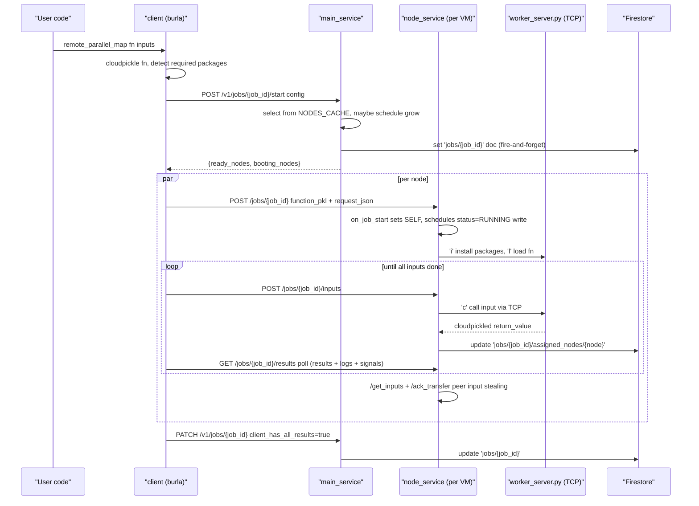

# Job Lifecycle: `remote_parallel_map` end-to-end

One call to `remote_parallel_map(function, inputs)` touches all four services. Here's what happens, in order.

## Sequence overview

## Phase 1 — Client side: prepare and request a job slot

Entry point: [client/src/burla/_remote_parallel_map.py](../../../client/src/burla/_remote_parallel_map.py) `remote_parallel_map` → `_execute_job_wrapped` → `_execute_job`.

1. `cloudpickle.dumps(function_)` — functions >0.1 GB raise `FunctionTooBig`.
2. `get_modules_required_on_remote` inspects the stack to detect local modules that need syncing to workers, plus their pypi dependencies.
3. `job_id = f"{function_.__name__}-{urlsafe_base64(uuid4().bytes[:9])}"` — chosen client-side so both the client and `main_service` reference the same id.
4. The client POSTs once to `main_service` at **`/v1/jobs/{job_id}/start`** (via `ClusterClient.start_job` in [client/src/burla/_cluster_client.py](../../../client/src/burla/_cluster_client.py)). This replaces what used to be three calls (`GET /v1/cluster/state` → local node selection → `POST /v1/cluster/grow` → `POST /v1/jobs/{id}`). The body includes `n_inputs`, `func_cpu`, `func_ram`, `max_parallelism`, `packages`, `user_python_version`, `burla_client_version`, `function_name`, `function_size_gb`, `started_at`, `is_background_job`, `grow`, `image`, `func_gpu`.
5. `main_service` handles selection itself inside `start_job` ([main_service/src/main_service/endpoints/client.py](../../../main_service/src/main_service/endpoints/client.py)):
   - Validates the client version is in `[MIN_COMPATIBLE_CLIENT_VERSION, CURRENT_BURLA_VERSION]`; otherwise returns `409 version_mismatch`.
   - `_select_ready_nodes_from_cache` walks `NODES_CACHE` for `READY`, non-reserved nodes matching `image` / `func_gpu` / `func_cpu` / `func_ram`. The cache is kept in sync by a Firestore `on_snapshot` listener started in `lifespan`, so this is a pure in-memory lookup.
   - If no ready nodes and `grow=True`, `_grow_if_needed` schedules `_start_nodes(..., reserved_for_job=job_id)` as a background task, pre-generates instance names, and returns them as `booting_nodes` so the client can start waiting. For CPU n4-standard clusters it packs the required CPUs into one or more n4-standard sizes via `_pack_n4_standard_machines`; for GPU jobs it uses the mapped GPU machine type; otherwise it uses the configured cluster machine type.
   - Writes `jobs/{job_id}` to Firestore **fire-and-forget** from `_write_initial_job_doc` — the response returns while the write is still in flight (see the `_in_flight_job_doc_writes` task set).
6. Response shape: `{"ready_nodes": [{instance_name, host, machine_type, target_parallelism}], "booting_nodes": [{instance_name, target_parallelism}]}`. If no ready nodes and some are still BOOTING/RUNNING, returns `503 nodes_busy` and the client calls `wait_for_nodes_to_be_ready` (polls `GET /v1/cluster/state`) before retrying once.

## Phase 2 — Client-to-node: upload function + inputs

For each node, the client calls `node.execute_job(...)` (in [client/src/burla/_node.py](../../../client/src/burla/_node.py)), which does:

1. **POST `/jobs/{job_id}`** on the node, multipart form:
   - `function_pkl` file
   - `request_json` (a JSON string) containing `parallelism` (= this node's `target_parallelism`), `is_background_job`, `user_python_version`, `n_inputs`, `packages`, `start_time`, `node_ids_expected`, `cluster_dashboard_url`.
2. Uploads inputs in batches via **POST `/jobs/{job_id}/inputs`** (multipart `inputs_pkl_with_idx`). Each upload is size-capped (~2 MB wire, 200 MB per individual input). Many uploads over the life of the job.
3. Polls **GET `/jobs/{job_id}/results`** — response is a pickled dict with `{"results": [...], "current_parallelism": int, "logs": [...], "cluster_shutdown": bool, "cluster_restarted": bool, "dashboard_canceled": bool}`. The client drains results, streams `logs` to the terminal via `_print_logs`, and raises `ClusterShutdown` / `ClusterRestarted` / `JobCanceled` if any signal is set.
4. In parallel, `remote_parallel_map` runs a `send_alive_pings` subprocess ([client/src/burla/_heartbeat.py](../../../client/src/burla/_heartbeat.py)) that (a) POSTs to each node's `/client-heartbeat` every 0.5s and (b) PATCHes `jobs/{job_id}` with `client_heartbeat_at` every 2s (which bumps the doc's `update_time`, used by `job_watcher` for liveness). The subprocess is respawned whenever the set of node hosts changes.

All client ↔ node traffic uses a single `aiohttp.ClientSession` with connection pool limits (see `_execute_job_wrapped`). The client never reads or writes Firestore directly — all job-doc updates (`all_inputs_uploaded`, `client_has_all_results`, `fail_reason_append`) go through `PATCH /v1/jobs/{job_id}` on `main_service`.

## Phase 3 — Node side: accept job, assign workers

On `POST /jobs/{job_id}` arrival, the `CallHookOnJobStartMiddleware` in [node_service/src/node_service/__init__.py](../../../node_service/src/node_service/__init__.py) intercepts *before* the body is read:

1. If `SELF["SHUTTING_DOWN"]` returns 503.
2. If `SELF["RUNNING"]` or `SELF["BOOTING"]` returns 409.
3. Otherwise wraps `receive` so `on_job_start` fires on the first `http.request` event: `SELF["RUNNING"]=True`, `SELF["current_job"]=job_id`, `SELF["reserved_for_job"]=None`, and it schedules (but does **not** await) `node_doc.update({"status":"RUNNING","current_job":job_id,"reserved_for_job":None})` as `SELF["on_job_start_task"]`. SELF is mutated synchronously so the next middleware call sees the state immediately; the Firestore write is kicked off the critical path.

Then the `execute` handler in [node_service/src/node_service/job_endpoints.py](../../../node_service/src/node_service/job_endpoints.py):

1. Walks `SELF["workers"]` and picks workers whose Python version matches `user_python_version` until `future_parallelism >= request_json["parallelism"]`.
2. If zero matches, **awaits `SELF["on_job_start_task"]`** before flipping `SELF["RUNNING"]=False` and writing `status: "READY"` to Firestore, then returns 409 with a Python-version mismatch message. (Without the await the `on_job_start` write can race the rollback.)
3. Writes the client's auth token + email + project + dashboard URL into `NODE_AUTH_CREDENTIALS_PATH` (`/opt/burla/node_auth/burla_credentials.json`) — this is bind-mounted into every worker container and is how nested `remote_parallel_map` calls inside a UDF authenticate.
4. Installs `packages` on the first worker — all workers share a volume-mounted Python env, so one install covers the whole node.
5. Broadcasts the pickled function to every selected worker (`load_function` → TCP `l`), which also kicks off each worker's `_process_inputs` task.
6. Populates `SELF["auth_headers"]` from the incoming `Authorization` and `X-User-Email` headers — used for node-to-node calls during this job.
7. Clears `SELF["job_watcher_stop_event"]` and launches the `job_watcher` asyncio task.

## Phase 4 — Worker execution (TCP protocol)

Workers are *not* HTTP. [worker_server.py](../../../node_service/src/node_service/worker_server.py) runs inside each user container and speaks a minimal socket protocol. The node-side driver is [worker_client.py](../../../node_service/src/node_service/worker_client.py).

**Handshake.** When the node connects, it writes a single byte (`b"s"`) and the worker echoes that byte back. This confirms the worker's `socket.create_server` accepted the connection before the command loop begins. Only one `accept()` ever runs — if the worker dies, the container's outer `while true; do python worker_server.py ...; done` relaunches it, and the node reconnects via `_reconnect`.

**Wire format.** Request: `<1-byte command><8-byte big-endian payload size><payload bytes>`. Response: `<1-byte status><8-byte size><payload>` where status is `s` (success) or `e` (error).

| Command | Meaning | Payload |
|---------|---------|---------|
| `r` | Reset — kill all other processes in the container, drop loaded function, clear burla auth cache | ignored |
| `i` | Install packages | `pickle.dumps({pkg_name: version, ...})` |
| `l` | Load function | `cloudpickle.dumps(function_)` |
| `c` | Call function with one input | `pickle.dumps({"input_index": i, "argument_bytes": cloudpickle.dumps(arg)})` |

**Reset caveat.** `reset()` in `worker_client.py` only uses the `r` command when the worker is idle. If it's mid-UDF the container is restarted instead (the worker_server main thread is blocked in user code and can't service the socket until the call returns).

**Log markers.** Around each `c` call the worker prints `__burla_input_start__:{idx}` / `__burla_input_end__:{idx}` to stdout. `JobLogWriter` (in worker_client.py) streams the container's stdout, uses the markers to attribute lines to specific input indices, batches them into ~100 KB Firestore docs at `jobs/{job_id}/logs`, **and** appends them to `SELF["pending_logs"]` (bounded deque, capacity 20,000). The client drains `pending_logs` off each `/results` response. If the deque overflows, a synthetic "Logs dequeued due to high volume" message is prepended so the user knows some were dropped.

**Error handling.** Two paths:
- *UDF error* — worker returns status `e` with `pickle.dumps({"error_info": {"type":..., "exception":..., "traceback_dict": Traceback(...).to_dict()}})`. The node attaches a `burla_error_info` attribute to the raised exception, then `_process_inputs` serializes it as `pickle.dumps(error_info)` into the result tuple.
- *Infrastructure error* (worker container died, OOM, etc.) — node serializes `pickle.dumps({"traceback_str": ..., "is_infrastructure_error": True})`. Client's `_gather_results` checks for `is_infrastructure_error` and raises `NodeDisconnected` instead of re-raising inside user code.

## Phase 5 — Node job_watcher: drain results, signal completion

[job_watcher.py](../../../node_service/src/node_service/job_watcher.py) runs for the life of the job. Setup:

- Waits (up to 2s) for `jobs/{job_id}` to appear in Firestore — `main_service` writes it fire-and-forget so a fast network can race the node.
- Creates `jobs/{job_id}/assigned_nodes/{instance_name}` with `{"current_num_results": 0, "client_contact_last_1s": True}`.
- Subscribes to `jobs/{job_id}` via `on_snapshot` — this is how `CANCELED`, `FAILED`, `all_inputs_uploaded`, `cluster_shutdown`, `cluster_restarted`, `dashboard_canceled` reach the node. The `update_time` of each snapshot is also captured as `last_job_doc_update_time` for liveness checks.

Main loop, on a 20ms (or 200ms if idle and job is older than 7s) cadence:

1. Recomputes `SELF["current_parallelism"]` from each worker's `is_idle`.
2. If `current_num_results` changed or workers are busy but we haven't updated in 2s, PATCHes `jobs/{id}/assigned_nodes/{node}.current_num_results`. Same doc also tracks `client_contact_last_1s` which is flipped whenever `sec_since_last_activity` crosses `CLIENT_CONTACT_TIMEOUT_SEC` (5s).
3. If the direct `/client-heartbeat` has been silent for 5s **and** the job doc's `update_time` is stale for `JOB_DOC_CONTACT_TIMEOUT_SEC` (8s), checks whether any sibling `assigned_nodes` doc still shows the client connected — if not, and the job can't survive a disconnect (not a background job, or inputs not all uploaded yet), marks the job `FAILED` with `fail_reason` "Client DC".
4. Detects completion: when `all_inputs_uploaded` is True, the local inputs queue is empty, all workers are idle, and `SELF["results_queue"]` is empty, checks `client_has_all_results` on the job doc (or, if the client is already disconnected, sums `current_num_results` across all `assigned_nodes` and compares to `n_inputs`). If complete, updates job `status` to `COMPLETED`, cancels the steal task, and runs `reset_workers` → `reinit_node` (which resets `SELF` while **preserving** `workers`, `authorized_users`, `current_container_config`, then PATCHes the node doc back to `status: "READY"`, `current_job: None`, `reserved_for_job: None`).

`_input_steal_loop` runs concurrently:

- Picks a neighbor by querying `nodes` for `status == RUNNING, current_job == SELF["current_job"]`, ordering by `FieldPath.document_id()`, and taking the next node in that ring after itself. If some `node_ids_expected` are still `BOOTING`, it retries later to include them.
- Once `all_inputs_uploaded` is true and >10s have elapsed, it `GET`s `{neighbor}/jobs/{id}/get_inputs` with a `transfer_id` and the current `requester_queue_size`. The neighbor splits its queue, stashes the chosen items in `SELF["pending_transfers"][transfer_id]`, and returns them. The stealer then POSTs `{neighbor}/jobs/{id}/ack_transfer?transfer_id=...&received=true|false` — success deletes the pending batch, failure re-enqueues it. If ACK fails for `ACK_RETRY_TIMEOUT_SEC` (600s) the stealer marks the job FAILED to preserve exactly-once semantics.
- `SEC_NEIGHBOR_HAD_NO_INPUTS` (module-global) tracks how long the neighbor has returned empty. Once it exceeds `EMPTY_NEIGHBOR_TIMEOUT_SEC` (60s) and this node is idle, `job_watcher` treats the node's work as finished and starts the completion path above.

The old `/input_transfer` endpoint no longer exists.

## Phase 6 — Cleanup

When `total_result_count >= n_inputs` client-side:

1. Client PATCHes `jobs/{id}` via main_service with `client_has_all_results: True`.
2. Client cancels all `node_tasks`.
3. Each node's `job_watcher` sees the signal (through `_on_job_snapshot` or its direct `get()`), cancels the steal task, updates `jobs/{id}.status = "COMPLETED"`, calls `reset_workers` → `reinit_node`. Worker containers are kept; only `SELF` is partially reset (workers, authorized_users, current_container_config survive).
4. If a worker reset fails, the node reboots its containers via `reboot_containers`.

If a node flips to `FAILED` mid-job, the client raises `NodeDisconnected`. If a node's heartbeat is lost, the client still catches the exception and asks main_service via `GET /v1/jobs/{id}` whether a lifecycle signal (`cluster_shutdown`, `cluster_restarted`, `dashboard_canceled`) was set — if so, it raises the matching domain exception instead of the bare network error.

## Cancellation paths

There are three ways a job can cancel:

1. **User hits Ctrl-C in the terminal** — `install_signal_handlers` in [client/src/burla/_helpers.py](../../../client/src/burla/_helpers.py) sets `terminal_cancel_event`, and for background jobs whose inputs are already uploaded it also PATCHes `jobs/{id}` so the cluster keeps running. `_execute_job` notices the flag and returns; `remote_parallel_map` then either returns silently (detach jobs with all inputs uploaded) or raises `JobCanceled("Job canceled by user.")`.
2. **User clicks cancel in the dashboard** — `main_service` `POST /v1/jobs/{id}/stop` ([main_service/src/main_service/endpoints/jobs.py](../../../main_service/src/main_service/endpoints/jobs.py)) writes `jobs/{id}.status = "CANCELED"`, `dashboard_canceled = True`, and appends a log doc. Each node's `_on_job_snapshot` caches `dashboard_canceled` into `SELF["pending_dashboard_canceled"]`, which rides out on the next `/results` response. The client raises `JobCanceled("Job canceled from dashboard.")`.
3. **UDF raises** — worker returns status `e`, node-side `_process_inputs` attaches `burla_error_info` and puts the error into `SELF["results_queue"]`, the client reconstructs the traceback via `tblib` and re-raises with the original stack. `JobLogWriter.write_error` also logs the traceback to `jobs/{id}/logs` with `is_error=True` for the dashboard.

## Common gotcha: the "started" race

`CallHookOnJobStartMiddleware` wraps `receive` so `on_job_start` runs as soon as the request body starts arriving, not when the handler completes. This exists so uploading a large pickled function doesn't leave the node in `READY` for seconds while the client thinks it's `RUNNING`.

If `execute` later finds no matching workers and has to roll back the node to `READY`, it must `await SELF["on_job_start_task"]` before issuing the rollback update — otherwise the pending RUNNING write can land *after* the rollback's READY write and wedge the node. See the `if not workers_to_assign` block in [job_endpoints.py](../../../node_service/src/node_service/job_endpoints.py).
