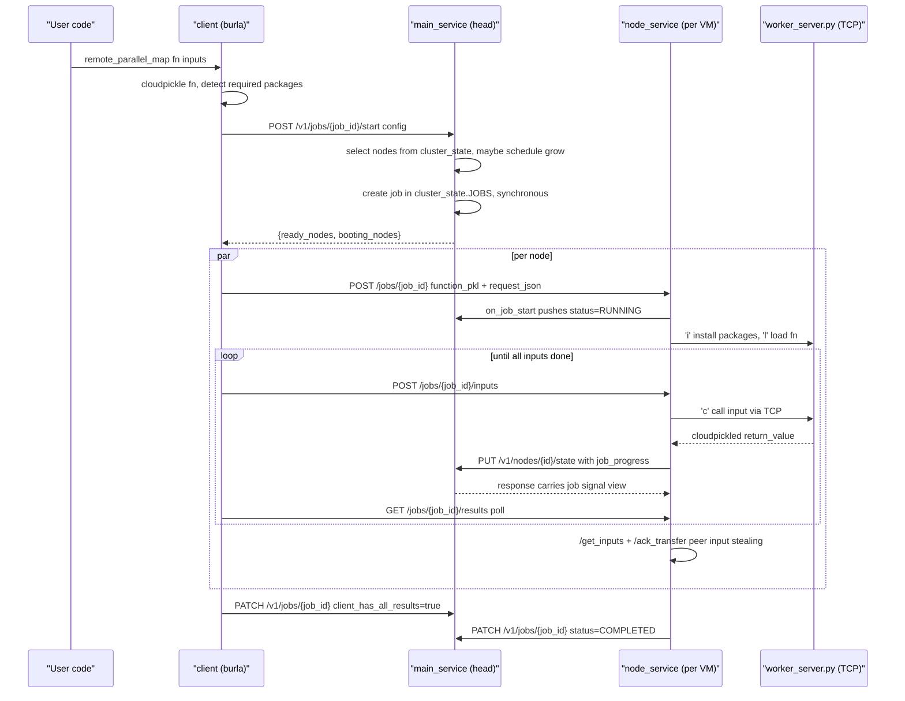

# Job Lifecycle: `remote_parallel_map` end-to-end

One call to `remote_parallel_map(function, inputs)` touches all four services. Here's what happens, in order.

## Sequence overview

```mermaid
sequenceDiagram
    participant User as "User code"
    participant Client as "client (burla)"
    participant Main as "main_service (head)"
    participant Node as "node_service (per VM)"
    participant Worker as "worker_server.py (TCP)"

    User->>Client: remote_parallel_map fn inputs
    Client->>Client: cloudpickle fn, detect required packages
    Client->>Main: POST /v1/jobs/{job_id}/start config
    Main->>Main: select nodes from cluster_state, maybe schedule grow
    Main->>Main: create job in cluster_state.JOBS, synchronous
    Main-->>Client: {ready_nodes, booting_nodes}
    par per node
        Client->>Node: POST /jobs/{job_id} function_pkl + request_json
        Node->>Main: on_job_start pushes status=RUNNING
        Node->>Worker: 'i' install packages, 'l' load fn
        loop until all inputs done
            Client->>Node: POST /jobs/{job_id}/inputs
            Node->>Worker: 'c' call input via TCP
            Worker-->>Node: cloudpickled return_value
            Node->>Main: PUT /v1/nodes/{id}/state with job_progress
            Main-->>Node: response carries job signal view
            Client->>Node: GET /jobs/{job_id}/results poll
        end
        Node->>Node: /get_inputs + /ack_transfer peer input stealing
    end
    Client->>Main: PATCH /v1/jobs/{job_id} client_has_all_results=true
    Node->>Main: PATCH /v1/jobs/{job_id} status=COMPLETED
```

## Phase 1: Client side, prepare and request a job slot

Entry point: [client/src/burla/_remote_parallel_map.py](../../../client/src/burla/_remote_parallel_map.py) `remote_parallel_map` → `_execute_job_wrapped` → `_execute_job`.

1. `cloudpickle.dumps(function_)`: functions >0.1 GB raise `FunctionTooBig`.
2. `get_modules_required_on_remote` inspects the stack to detect local modules that need syncing to workers, plus their pypi dependencies.
3. `job_id = f"{function_.__name__}-{urlsafe_base64(uuid4().bytes[:9])}"`: chosen client-side so both the client and `main_service` reference the same id.
4. The client POSTs once to `main_service` at **`/v1/jobs/{job_id}/start`** (via `ClusterClient.start_job` in [client/src/burla/_cluster_client.py](../../../client/src/burla/_cluster_client.py)). The body includes `n_inputs`, `func_cpu`, `func_ram`, `max_parallelism`, `packages`, `user_python_version`, `burla_client_version`, `function_name`, `function_size_gb`, `started_at`, `is_background_job`, `grow`, `image`, `func_gpu`.
5. `main_service` handles selection itself inside `start_job` ([main_service/src/main_service/endpoints/client.py](../../../main_service/src/main_service/endpoints/client.py)):
   - Validates the client version is in `[MIN_COMPATIBLE_CLIENT_VERSION, CURRENT_BURLA_VERSION]`; otherwise returns `409 version_mismatch`.
   - `_select_ready_nodes_from_state` walks `cluster_state.list_nodes()` for `READY`, non-reserved nodes matching `image` / `func_gpu` / `func_cpu` / `func_ram`. This is a pure in-memory lookup: the live node dicts are kept current by each node's ~1s state pushes, so there is no cache layer and nothing to warm.
   - If capacity falls short and `grow=True`, `_grow_if_needed` schedules `_start_nodes(..., reserved_for_job=job_id)` as a background task, pre-generates instance names, and returns them as `booting_nodes` so the client can start waiting. For packable CPU machine families (`n4-standard-*` on GCP, `m7i.*` on AWS) it packs the required CPUs into standard sizes via `pack_cpu_machines` in [providers/catalog.py](../../../main_service/src/main_service/providers/catalog.py); for GPU jobs it uses the mapped GPU machine type; otherwise it uses the configured cluster machine type.
   - Creates the job **synchronously in memory** via `cluster_state.create_job` (run in a thread because it also persists a history row). There is no fire-and-forget write and no node-side wait-for-the-job-to-appear race: by the time the client can contact a node, the job already exists on the head.
6. Response shape: `{"ready_nodes": [{instance_name, host, machine_type, target_parallelism}], "booting_nodes": [{instance_name, target_parallelism}]}`. Errors: `503 nodes_busy` when no ready nodes but some are BOOTING/RUNNING (client polls `GET /v1/cluster/state` via `wait_for_nodes_to_be_ready` then retries once), `409 no_compatible_nodes` with a reason (`image_mismatch` / `gpu_mismatch` / `insufficient_capacity`) when ready nodes exist but none fit, `404 no_nodes` when the cluster is empty and `grow=False`.

## Phase 2: Client-to-node, upload function + inputs

For each node, the client calls `node.execute_job(...)` (in [client/src/burla/_node.py](../../../client/src/burla/_node.py)), which does:

1. **POST `/jobs/{job_id}`** on the node, multipart form:
   - `function_pkl` file
   - `request_json` (a JSON string) containing `parallelism` (= this node's `target_parallelism`), `is_background_job`, `user_python_version`, `n_inputs`, `packages`, `start_time`, `node_ids_expected`, `cluster_dashboard_url`.
2. Uploads inputs in batches via **POST `/jobs/{job_id}/inputs`** (multipart `inputs_pkl_with_idx`). Each upload is size-capped (~2 MB wire, 200 MB per individual input). Many uploads over the life of the job.
3. Polls **GET `/jobs/{job_id}/results`**: response is a pickled dict with `{"result_batch_id": ..., "results": [...], "current_parallelism": int, "dynamic_worker_reduction": ..., "logs": [...], "cluster_shutdown": bool, "cluster_restarted": bool, "dashboard_canceled": bool}`. The client drains results, streams `logs` to the terminal via `_print_logs`, and raises `ClusterShutdown` / `ClusterRestarted` / `JobCanceled` if any signal is set.
4. In parallel, `remote_parallel_map` runs a `send_alive_pings` subprocess ([client/src/burla/_heartbeat.py](../../../client/src/burla/_heartbeat.py)) that POSTs to each node's `/client-heartbeat` every 0.5s. That is its **only** job: the old 2s `PATCH jobs/{id}.client_heartbeat_at` loop through `main_service` is gone, along with the job-doc `update_time` liveness check. The subprocess starts ~5s into the job and is respawned whenever the set of ready node hosts changes. Nodes fold "heard from the client in the last 1s" into their state pushes, and the head aggregates that into the disconnect quorum (see phase 5).

All client ↔ node traffic uses a single `aiohttp.ClientSession` with connection pool limits (see `_execute_job_wrapped`). There is no database for the client to talk to: all job updates (`all_inputs_uploaded`, `client_has_all_results`, `status`, `fail_reason_append`) go through `PATCH /v1/jobs/{job_id}` on `main_service`, which merges them into the in-memory job dict. Nodes see those flags in their next push response, within ~1s.

## Phase 3: Node side, accept job, assign workers

On `POST /jobs/{job_id}` arrival, the `CallHookOnJobStartMiddleware` in [node_service/src/node_service/__init__.py](../../../node_service/src/node_service/__init__.py) intercepts *before* the body is read:

1. If `SELF["SHUTTING_DOWN"]` returns 503.
2. If `SELF["RUNNING"]` or `SELF["BOOTING"]` returns 409.
3. Otherwise wraps `receive` so `on_job_start` fires on the first `http.request` event: `SELF["RUNNING"]=True`, `SELF["current_job"]=job_id`, `SELF["reserved_for_job"]=None`, `SELF["reported_status"]="RUNNING"`, and it cancels any running `_watch_reservation` task. It then schedules (but does **not** await) `head_client.push_state(status="RUNNING", current_job=job_id, reserved_for_job=None)` as `SELF["on_job_start_task"]`. SELF is mutated synchronously so the next middleware call sees the state immediately; the push to the head is kicked off the critical path.

Then the `execute` handler in [node_service/src/node_service/job_endpoints.py](../../../node_service/src/node_service/job_endpoints.py):

1. Walks `SELF["workers"]` and picks workers whose Python version matches `user_python_version` until `future_parallelism >= request_json["parallelism"]`.
2. If zero matches, **awaits `SELF["on_job_start_task"]`** before flipping `SELF["RUNNING"]=False` and pushing `READY` to the head, then returns 409 with a Python-version mismatch message. (Without the await the `on_job_start` push can race the rollback push.)
3. Writes the client's auth token + email + project + dashboard URL into `NODE_AUTH_CREDENTIALS_PATH` (`/opt/burla/node_auth/burla_credentials.json`): this is bind-mounted into every worker container and is how nested `remote_parallel_map` calls inside a UDF authenticate.
4. Installs `packages` on the first worker: all workers share a volume-mounted Python env, so one install covers the whole node.
5. Broadcasts the pickled function to every selected worker (`load_function` → TCP `l`), which also kicks off each worker's `_process_inputs` task.
6. Populates `SELF["auth_headers"]` from the incoming `Authorization` and `X-User-Email` headers: used for node-to-node calls during this job.
7. Clears `SELF["job_watcher_stop_event"]` and launches the `job_watcher` asyncio task.

## Phase 4: Worker execution (TCP protocol)

Workers are *not* HTTP. [worker_server.py](../../../node_service/src/node_service/worker_server.py) runs inside each user container and speaks a minimal socket protocol. The node-side driver is [worker_client.py](../../../node_service/src/node_service/worker_client.py).

**Handshake.** When the node connects, it writes a single byte (`b"s"`) and the worker echoes that byte back. This confirms the worker's `socket.create_server` accepted the connection before the command loop begins. Only one `accept()` ever runs: if the worker dies, the container's outer `while true; do python worker_server.py ...; done` relaunches it, and the node reconnects via `_reconnect`.

**Wire format.** Request: `<1-byte command><8-byte big-endian payload size><payload bytes>`. Response: `<1-byte status><8-byte size><payload>` where status is `s` (success) or `e` (error).

| Command | Meaning | Payload |
|---------|---------|---------|
| `r` | Reset: kill all other processes in the container, drop loaded function, clear burla auth cache | ignored |
| `i` | Install packages | `pickle.dumps({pkg_name: version, ...})` |
| `l` | Load function | `cloudpickle.dumps(function_)` |
| `c` | Call function with one input | `pickle.dumps({"input_index": i, "argument_bytes": cloudpickle.dumps(arg)})` |

**Reset caveat.** `reset()` in `worker_client.py` only uses the `r` command when the worker is idle. If it's mid-UDF the container is restarted instead (the worker_server main thread is blocked in user code and can't service the socket until the call returns).

**Log markers.** Around each `c` call the worker prints `__burla_input_start__:{idx}` / `__burla_input_end__:{idx}` to stdout. `JobLogWriter` (in worker_client.py) streams the container's stdout, uses the markers to attribute lines to specific input indices, batches them into ~100 KB log documents POSTed to the head at `/v1/jobs/{job_id}/logs:batch` (timestamps are epoch floats; the head stores them in the SQLite history db for the dashboard), **and** appends them to `SELF["pending_logs"]` (bounded deque, capacity 20,000). The client drains `pending_logs` off each `/results` response. If the deque overflows, a synthetic "Logs dequeued due to high volume" message is prepended so the user knows some were dropped. A failed POST to the head only loses the dashboard copy; the client still gets the logs live.

**Error handling.** Two paths:
- *UDF error*: worker returns status `e` with `pickle.dumps({"error_info": {"type":..., "exception":..., "traceback_dict": Traceback(...).to_dict()}})`. The node attaches a `burla_error_info` attribute to the raised exception, then `_process_inputs` serializes it as `pickle.dumps(error_info)` into the result tuple.
- *Infrastructure error* (worker container died, OOM, etc.): node serializes `pickle.dumps({"traceback_str": ..., "is_infrastructure_error": True})`. Client's `_gather_results` checks for `is_infrastructure_error` and raises `NodeDisconnected` instead of re-raising inside user code.

## Phase 5: Node job_watcher: drain results, signal completion

[job_watcher.py](../../../node_service/src/node_service/job_watcher.py) runs for the life of the job. There are no watches or listeners: every signal arrives in the job view carried by state-push responses (the 1s `_state_push_loop` in `__init__.py` plus direct `_push_progress()` calls at decision points; `head_client.apply_job_signals` copies each view into `SELF`).

Setup:

- The first `_push_progress()` registers this node's progress with the head (creating the job's `assigned_nodes[instance_name]` entry) and returns the job's current signal set: `{exists, status, all_inputs_uploaded, client_has_all_results, dashboard_canceled, cluster_shutdown, cluster_restarted, any_node_client_contact, total_num_results, n_inputs}`. The job was created synchronously inside `POST /v1/jobs/{id}/start`, so `exists: false` means something is genuinely wrong and the watcher raises.
- Launches `_input_steal_loop` as a concurrent task.

Main loop, on a 20ms (or 200ms if idle and job is older than 7s) cadence:

1. Recomputes `SELF["current_parallelism"]` from each worker's `is_idle` (retired workers excluded).
2. Reads the freshest signal view from `SELF["job_view"]`; `status == "FAILED"` / `"CANCELED"` flips local flags.
3. Pushes progress immediately via `_push_progress()` when the input queue is empty and the result count changed, when workers are busy but no update has gone out for 2s, or when the client-contact flag flipped. The push body carries `job_progress: {job_id, current_num_results, client_contact_last_1s}`; the steady state is covered by the 1s loop.
4. Client liveness: `client_contact_last_1s` is true when any client request (the 0.5s direct `/client-heartbeat` included) landed within `CLIENT_CONTACT_TIMEOUT_SEC` (5s), or an open request is younger than 15s. A disconnect requires this local flag to be false **and** `any_node_client_contact` to be false in the job view: the head aggregates every assigned node's flag, so one node still hearing the client keeps the whole job alive. (The old `JOB_DOC_CONTACT_TIMEOUT_SEC` job-doc staleness check no longer exists.) If the job can't survive a disconnect (not a background job, or inputs not all uploaded yet), the node PATCHes the job `FAILED` with fail reason "Client DC"; if a lifecycle cancel signal is already set it's treated as canceled instead.
5. Detects completion: when `all_inputs_uploaded` is true, the local inputs queue (including pending transfers) is empty, and all workers are idle, it pushes progress once more and completes if `client_has_all_results` is true, or, when the client is disconnected/detached, if `total_num_results == n_inputs` in the returned view. On completion/failure/cancel it cancels the steal task, PATCHes the job status (`COMPLETED` unless the view already says FAILED/CANCELED; the head ignores a COMPLETED write unless the job is still RUNNING), and runs `reset_workers` → `reinit_node` (which resets `SELF` while **preserving** `workers`, `authorized_users`, `current_container_config`, then pushes `READY` with `current_job: None`, `reserved_for_job: None`).

`_input_steal_loop` runs concurrently:

- Picks a neighbor via `get_neighbor`, which calls **`GET /v1/jobs/{id}/peers`** on the head: `{"peers": [{"instance_name", "host"}], "booting_node_ids": [...]}`, a name-sorted ring of RUNNING nodes assigned to this job. It takes the next node in the ring after itself. If some `node_ids_expected` are missing but still listed in `booting_node_ids`, it re-fetches later so late joiners enter the ring.
- Once `all_inputs_uploaded` is true and >10s have elapsed, it `GET`s `{neighbor}/jobs/{id}/get_inputs` with a `transfer_id` and the current `requester_queue_size`. The neighbor splits its queue, stashes the chosen items in `SELF["pending_transfers"][transfer_id]`, and returns them. The stealer then POSTs `{neighbor}/jobs/{id}/ack_transfer?transfer_id=...&received=true|false`: success deletes the pending batch, failure re-enqueues it. If ACK fails for `ACK_RETRY_TIMEOUT_SEC` (600s) the stealer PATCHes the job FAILED to preserve exactly-once semantics.
- `SEC_NEIGHBOR_HAD_NO_INPUTS` (module-global) tracks how long the neighbor has returned empty. Once it exceeds `EMPTY_NEIGHBOR_TIMEOUT_SEC` (120s) and this node is idle, `job_watcher` treats the node's work as finished, resets its workers, and exits (without writing a job status; whichever node observes actual completion writes that).

The old `/input_transfer` endpoint no longer exists.

## Phase 6: Cleanup

When `total_result_count >= n_inputs` client-side:

1. Client PATCHes `jobs/{id}` via main_service with `client_has_all_results: True`.
2. Client cancels all `node_tasks`.
3. Each node's `job_watcher` sees `client_has_all_results` in the job view on its next push (within ~1s), cancels the steal task, PATCHes `jobs/{id}.status = "COMPLETED"`, calls `reset_workers` → `reinit_node`. Worker containers are kept; only `SELF` is partially reset (workers, authorized_users, current_container_config survive), and the node pushes `READY` to the head.
4. If a worker reset fails, the node reboots its containers via `reboot_containers`.

If a node flips to `FAILED` mid-job, the client raises `NodeDisconnected`. If a node's heartbeat is lost, the client still catches the exception and asks main_service via `GET /v1/jobs/{id}` whether a lifecycle signal (`cluster_shutdown`, `cluster_restarted`, `dashboard_canceled`) was set; if so, it raises the matching domain exception instead of the bare network error.

## Cancellation paths

There are three ways a job can cancel:

1. **User hits Ctrl-C in the terminal**: `install_signal_handlers` in [client/src/burla/_helpers.py](../../../client/src/burla/_helpers.py) sets `terminal_cancel_event`. Unless it's a detach job whose inputs are all uploaded (that keeps running; a dashboard link is printed), the handler synchronously PATCHes the job to `CANCELED` with a fail reason through main_service (best effort: if the head is unreachable the nodes still detect the disconnect via the heartbeat quorum). `_execute_job` notices the flag and returns; `remote_parallel_map` then either returns silently (detach jobs with all inputs uploaded) or raises `JobCanceled("Job canceled by user.")`.
2. **User clicks cancel in the dashboard**: `main_service` `POST /v1/jobs/{id}/stop` ([main_service/src/main_service/endpoints/jobs.py](../../../main_service/src/main_service/endpoints/jobs.py)) sets `status: "CANCELED"` + `dashboard_canceled: True` in `cluster_state` and appends an error log doc to history. Each node's next state-push response carries `dashboard_canceled` in the job view; `apply_job_signals` caches it into `SELF["pending_dashboard_canceled"]`, which rides out on the next `/results` response. The client raises `JobCanceled("Job canceled from dashboard.")`. End-to-end signal latency is about one push interval (~1s).
3. **UDF raises**: worker returns status `e`, node-side `_process_inputs` attaches `burla_error_info` and puts the error into `SELF["results_queue"]`, the client reconstructs the traceback via `tblib` and re-raises with the original stack. `JobLogWriter.write_error` also POSTs the traceback to `/v1/jobs/{id}/logs:batch` with `is_error=True` for the dashboard.

## Common gotcha: the "started" race

`CallHookOnJobStartMiddleware` wraps `receive` so `on_job_start` runs as soon as the request body starts arriving, not when the handler completes. This exists so uploading a large pickled function doesn't leave the node in `READY` for seconds while the client thinks it's `RUNNING`. `on_job_start` mutates `SELF` synchronously and schedules the `RUNNING` push to the head as `SELF["on_job_start_task"]`, a background asyncio task kept off the upload's critical path.

If `execute` later finds no matching workers and has to roll the node back to `READY`, it must `await SELF["on_job_start_task"]` before pushing `READY` to the head; otherwise the pending RUNNING push can land *after* the rollback's READY push and leave the head stuck seeing RUNNING. See the `if not workers_to_assign` block in [job_endpoints.py](../../../node_service/src/node_service/job_endpoints.py).
