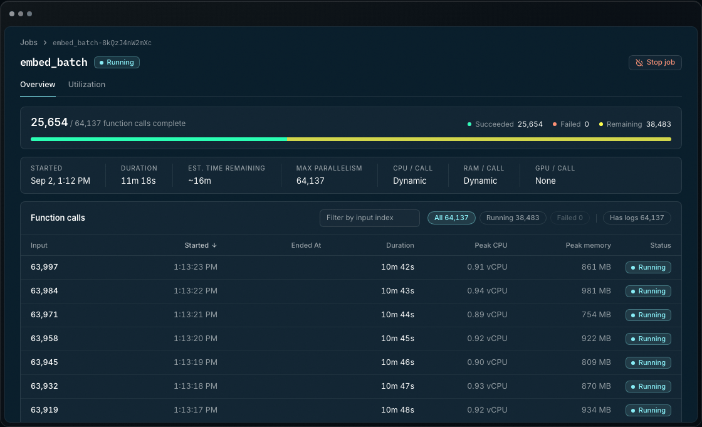

<p align="center">
  <a href="https://burla.dev">
    
  </a>
</p>

<p align="center">
  Burla is the world's simplest distributed computing platform.  </br>
  Easily scale ML‑pipelines, AI-inference, batch processing, or any other program.
</p>

<p align="center">
  <a href="https://burla.dev/docs">Documentation</a> ·
  <a href="https://burla.dev/docs/get-started">Getting started</a> ·
  <a href="https://burla.dev/docs/api-reference">API reference</a> ·
  <a href="https://burla.dev/docs/examples">Examples</a> ·
  <a href="https://burla.dev">Website</a>
</p>

<p align="center">
  <a href="https://pypi.org/project/burla/"></a>
  <a href="https://pepy.tech/projects/burla"></a>
  
  <a href="LICENSE"></a>
</p>

---

Burla runs Python functions in parallel across thousands of CPUs or GPUs in your cloud using one function:

```python
from burla import remote_parallel_map

def double(x):
    return x * 2

results = remote_parallel_map(double, range(1000), grow=True)
```
This code calls `double` on every item in `range(1000)`, each in a separate container (1-CPU each) in your current cloud provider.

#### Build fully distributed applications in plain Python.
Specify different hardware, or a custom Docker image, for each function call at runtime.  
`remote_parallel_map` can be nested to create composable distributed applications:

```python
from burla import remote_parallel_map
 
def build_index(day):
    docs = remote_parallel_map(parse, pdfs(day), func_cpu=64)
    vecs = remote_parallel_map(embed, docs, func_gpu="A100", image="pytorch")
    return remote_parallel_map(index, [vecs], func_ram=128)
 
remote_parallel_map(build_index, [last_30_days], detach=True)
```
With `detach=True` this pipeline will run independently in the cloud.

## Key features

- **Fast iteration:** Scale to 1,000 CPUs or GPUs in under a second on a warm cluster. Prints, exceptions, and results appear locally.
- **Automatic env replication:** Your local Python environment is automatically cloned on all remote workers in seconds.
- **Up to 50% more efficient:** Burla continuously adjusts concurrency keeping every machine saturated so jobs finish faster and cost less.
- **Pipelines:** Burla builds a live DAG showing how infrastructure changes throughout your distributed application.
- **Your cloud:** Run in your own AWS, Google Cloud, or Azure account. Share a deployed cluster with your team.

## Monitor distributed workloads in the dashboard:

Track every function call, inspect logs and tracebacks, spot resource bottlenecks, and manage workloads across your entire team.

[](https://burla.dev/#what)

## Get started

With Python 3.12+ & having [signed into your cloud provider's CLI](https://burla.dev/docs/get-started) (`aws`, `gcloud`, `az`):

```bash
pip install burla
burla dashboard
```

Run the Python example above. `grow=True` starts VMs in your cloud and removes them when the job finishes.  
To share dashboard access, or use background jobs, run `burla deploy`.

[Setup guide](https://burla.dev/docs/get-started) · [Examples](https://burla.dev/docs/examples) · [API reference](https://burla.dev/docs/api-reference)

## Contributing

Bug reports, feature requests, and contribution proposals are welcome in [GitHub issues](https://github.com/Burla-Cloud/burla/issues). Report security issues to security@burla.dev.

## License

Licensed under [FSL-1.1-Apache-2.0](LICENSE). Free to use except for competing commercial offerings; each version becomes Apache 2.0 after two years.

---

<p align="center">
  Questions? Email <a href="mailto:jake@burla.dev">jake@burla.dev</a> or <a href="https://cal.com/jakez/burla?user=jakez">book a call</a>, we're always happy to talk.
</p>
